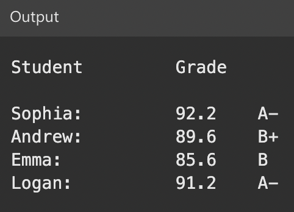

### GradingAutomationEnhancement Specifications

| No. | Enhancement | Details |
| --- | ----------- | ------- |
| 1. | **Arrays for Student Information:** | Implement arrays to store student names and their respective scores for graded assignments. Utilize appropriate data types for student names and assignment scores. |
| 2. | **Foreach Statement Usage:** | Use foreach statements to iterate through the arrays containing student names and assignment scores. Leverage foreach to access each element of the arrays during the grading process. |
| 3. | **Calculation of Final Grades:** | Inside the foreach code block, calculate each student's final grade based on the provided grading criteria. Include logic for handling extra credit assignments and their impact on final grades. |
| 4. | **If Statements for Grading Conditions:** | Use if statements to evaluate expressions and establish grading conditions. Assign final letter grades based on the calculated scores and any additional criteria specified by the teacher. |
| 5. | **Output Student Grades:** | Output the final grades for each student according to the teacher's score report specification. Ensure the output is clear, organized, and includes necessary information (student names, scores, and final grades). |
| 6. | **Documentation and Comments:** | Provide clear comments within the code to explain the logic and decision-making processes. Include inline comments for complex sections or any code requiring clarification. |
| 7. | **Testing and Validation:** | Test the application with various scenarios, including cases with and without extra credit assignments. Validate that the output aligns with the specified grading rules and accurately reflects the students' final grades. |
| 8. | **Code Efficiency:** | Optimize the code for efficiency, considering both performance and readability. Ensure that nested iterations and selection statements are used judiciously. |
| 9. | **Documentation Update:** | Update any existing documentation for the Student Grading application to reflect the changes made during this enhancement. Include a brief summary of the added functionality and improvements. |
| 10. | **Training Materials:** | If applicable, create or update training materials that guide users on the new features and functionalities introduced in the enhanced application. |

### Criteria for Student Grading Application

| Criteria | Details |
| -------- | ------- |
| Students | Start with four students. Each student has five exam scores. |
| Exam Scores | Each exam score is an integer value, 0-100, where 100 represents 100% correct. |
| Overall Exam Score | A student's overall exam score is the average of their five exam scores. |
| Extra Credit Assignments | - Include extra credit assignment scores in the student's scores array. - Extra credit assignments are worth 10% of an exam score (when calculating the final numeric grade). - Add extra credit assignment scores to the student's total exam score before calculating the final numeric grade. |
| Automatic Letter Grades | The application needs to automatically assign letter grades based on the calculated final score for each student. |
| Output | The application needs to output/display each student’s name and formatted grade. |
| Support for Additional Students | The application needs to support adding other students and scores with minimal impact on the code. |

### Letter Grade Correspondence to Numeric Scores

| Numeric Scores | Letter Grade |
| -------------- | ------------ |
| 97 - 100       | A+           |
| 93 - 96        | A            |
| 90 - 92        | A-           |
| 87 - 89        | B+           |
| 83 - 86        | B            |
| 80 - 82        | B-           |
| 77 - 79        | C+           |
| 73 - 76        | C            |
| 70 - 72        | C-           |
| 67 - 69        | D+           |
| 63 - 66        | D            |
| 60 - 62        | D-           |
| 0 - 59         | F            |

### Expected formatted student grading report

