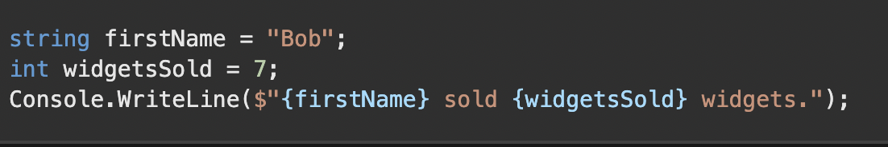
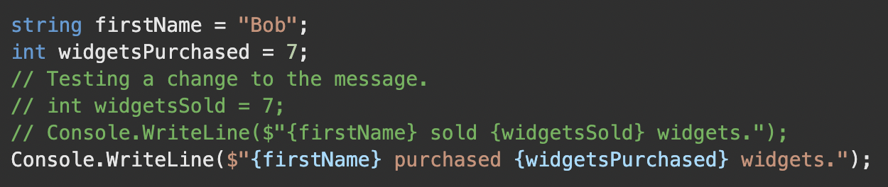
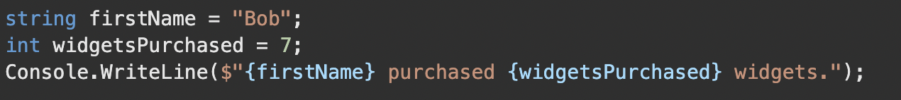
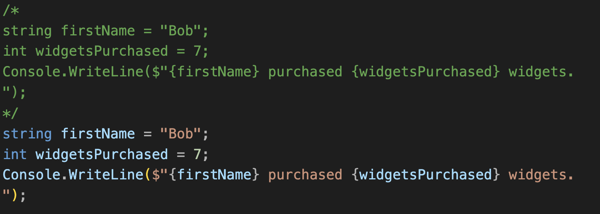

# Commenting Best Practices

## Low-Quality Commenting - Single Comments

### Without Comment:

### With Comment (green is comment):

*Notice: The 1st code went from being "sold" to "purchased". This just shows the logic. Safely delete the old code that was commented out.*

## High-Quality Commenting

### Block Comment "/* */" - A comment that explains the higher-level purpose of your code:

# Code Commenting Best Practices

1. **Intent Documentation:**
   - Use comments to document the *intent* of code passages, especially in challenging scenarios.
   - Include comments describing the purpose or thought process for better understanding.

2. **Temporary Code Removal:**
   - Comment out code temporarily to test new approaches.
   - Safely delete old commented code once convinced the new code works as intended.

3. **Use of TODO Comments:**
   - Add **TODO** comments to mark code for later investigation.
   - Use judiciously to highlight concerns for future attention.

4. **Comment Quality:**
   - Focus comments on *higher-level ideas* rather than explaining individual lines of code.
   - Avoid redundant comments about how an individual line works.
   - Regularly update comments when modifying code to maintain accuracy.

5. **Code Readability:**
   - Leverage comments for clarity but prioritize *clear and readable code*.
   - Understand that comments are *subjective*; use judgment to enhance code understanding.
