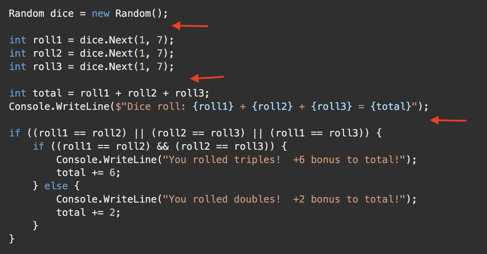

# Whitespace Usage Rules: Step-by-Step Guide

1. **Separate Statements:**
   - Each complete command (statement) belongs on a separate line.
   - Enhances readability by isolating distinct actions.

2. **Break Long Lines:**
   - If a single line of code becomes long, consider breaking it up.
   - Avoid arbitrarily splitting a statement into multiple lines unless there's a good reason.

3. **Space around Assignment Operators:**
   - Use a space to the left and right of the assignment operator (=).
   - Improves visual clarity around variable assignments.

4. **Vertical Whitespace:**
   - Introduce blank lines between two, three, or four lines of code that perform similar or related tasks.
   - Enhances readability by grouping related code blocks.

5. **Indentation for Code Blocks:**
   - Place opening and closing curly braces {} on separate lines.
   - Align code block symbols with the keyword they're associated with.
   - Indent code inside a block to visually indicate ownership.

6. **Consistent Line Breaks:**
   - Use line feeds to create empty lines to separate phrases of code.
   - Maintain consistency in line breaks throughout the code.

7. **Purposeful Alignment:**
   - Align code blocks under the keywords they belong to.
   - Provides clear visibility of code block boundaries.

8. **Consideration for Readability:**
   - Use whitespace judiciously to enhance overall code readability.
   - Subjective decisions may arise; use your best judgment.

9. **Group Related Variables:**
   - When declaring multiple variables, group them together with vertical whitespace.
   - Highlights similarities and differences, aiding comprehension.

10. **Whitespace with Control Structures:**
    - Place opening and closing braces of control structures (if, else) on their own lines.
    - Maintain consistent indentation for code inside control structures.

11. **Aligning Code Elements:**
    - Align similar elements in a visually consistent manner.
    - Improves the visual structure of the code.

12. **Consistency is Key:**
    - Establish and adhere to a consistent whitespace style throughout the codebase.
    - Facilitates collaboration and code maintenance.

### Example Rolling Dice code:

#### Without whitespace - notice no space 

#### Whitespace - between lines (red):

## Why Whitespace Rules Matter?

Whitespace rules are not arbitrary; they play a crucial role in making code more readable and maintainable. Understanding the significance of these rules can lead to better coding practices and collaboration. Here's why whitespace matters:

1. **Readability:**
   - Clear and well-structured code is easier to read and understand.
   - Consistent spacing and indentation guide developers through the logic of the code.

2. **Maintenance:**
   - Code with proper whitespace is easier to maintain and modify.
   - Developers can quickly identify sections, making updates and bug fixes more efficient.

3. **Collaboration:**
   - Consistent whitespace usage promotes a standard coding style across a team.
   - Eases collaboration by providing a uniform and predictable code structure.

4. **Debugging:**
   - Improved code visibility aids in debugging and troubleshooting.
   - Identifying and fixing issues becomes faster and more accurate.